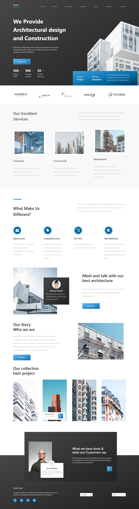

# Landing Page



## Description

This project is a web application built using React and styled with Bootstrap. It features a clean and organized layout that includes several key components, each serving a specific purpose:

Header: This component likely contains the navigation and branding elements of the application, providing users with access to different sections of the site.

Hero: Positioned prominently at the top of the page, the Hero component typically showcases a striking image or message to capture the users' attention and convey the main theme or purpose of the application.

Companies: This section may display logos or information about partner companies or clients, enhancing credibility and showcasing collaborations.

Services: Here, the application outlines the services offered, detailing what users can expect and how they can benefit from the offerings.

About: This component provides background information about the company or project, helping users understand its mission, vision, and values.

Footer: The footer wraps up the page with additional links, contact information, or legal disclaimers, ensuring users have easy access to important information.

Overall, the app is designed to present information in a user-friendly manner, with a responsive layout that adapts to different screen sizes, thanks to Bootstrap's styling capabilities. The use of React allows for a dynamic and interactive user experience.

## Technologies Used

- [React](https://reactjs.org/) - A JavaScript library for building user interfaces
- [Vite](https://vitejs.dev/) - A build tool that provides a faster and leaner development experience
- [@vitejs/plugin-react](https://github.com/vitejs/vite-plugin-react/blob/main/packages/plugin-react/README.md) - Enables Fast Refresh using Babel
- [@vitejs/plugin-react-swc](https://github.com/vitejs/vite-plugin-react-swc) - Enables Fast Refresh using SWC
- [Bootstrap](https://getbootstrap.com/) - A  popular front-end framework for building responsive web applications

## Installation

To get started with the project, follow these steps:

1. Clone the repository:
   ```bash
   git clone https://github.com/ismail06-49/project-landing-page.git